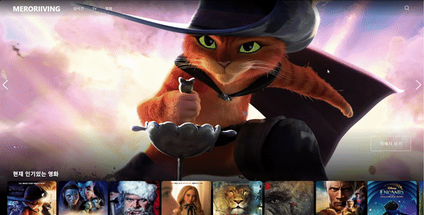
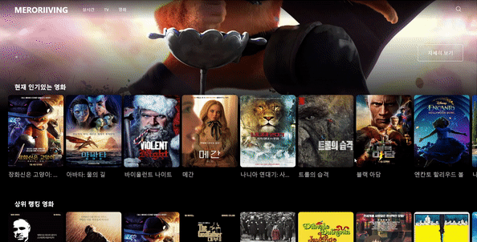
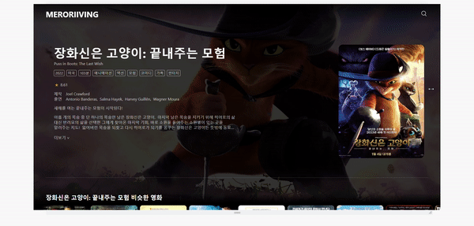
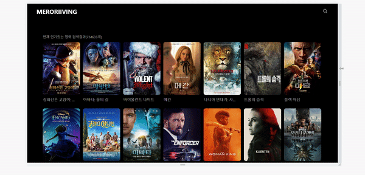

# **MERORRIVING**

tving 사이트 디자인을 참고하여 제작한 영화 정보 사이트  
https://meroriiving.vercel.app/
<br/><br/>

# **사용기술**


<br/><br/>

# **기능**

**DONE**

- [x] 메인화면
- [x] 상세화면
- [x] 검색화면
- [x] 항목별리스트화면
- [x] 슬라이드 컴포넌트화
- [x] 리스트페이지 인피니티스크롤 적용
- [x] 각 페이지 반응형 작업
- [x] 검색창 팝업 추가
- [x] 모바일 반응형 수정
- [x] 코드 리팩토링
  - [x] css 네이밍 통일
  - [x] 공통 부분 컴포넌트화

**TODO**

- [ ] 동영상 재생 기능 추가

<br/><br/>

# **개발과정**

blog : https://velog.io/@merorii/series/next.js-project

- [x] [next 프로젝트 setting](https://velog.io/@merorii/Next.js-%ED%94%84%EB%A1%9C%EC%A0%9D%ED%8A%B8-%EC%84%B8%ED%8C%85)
- [x] [react-query](https://velog.io/@merorii/Next.js-%ED%94%84%EB%A1%9C%EC%A0%9D%ED%8A%B8-Open-API)
- [x] [getserversideprops](https://velog.io/@merorii/Next.js-%ED%94%84%EB%A1%9C%EC%A0%9D%ED%8A%B8-getServersideProps)
- [x] [carousel](https://velog.io/@merorii/Next.js-%ED%94%84%EB%A1%9C%EC%A0%9D%ED%8A%B8-carousel-%EA%B5%AC%ED%98%84%ED%95%98%EA%B8%B0-react-slick)
- [x] [infinite scroll](https://velog.io/@merorii/Next.js-%ED%94%84%EB%A1%9C%EC%A0%9D%ED%8A%B8-infinite-scroll-%EA%B5%AC%ED%98%84%ED%95%98%EA%B8%B0)
- [x] [배포](https://velog.io/@merorii/Next.js-%ED%94%84%EB%A1%9C%EC%A0%9D%ED%8A%B8-%EB%B0%B0%ED%8F%ACgh-pages-netlify-vercel)
- [ ] 영상 재생
      <br/><br/>

# **화면**

## **🎈 메인페이지**

- 메인페이지 상단  
  
  - 추천 영화 4가지 fade형 슬라이드 자동재생  
    <br/>
- 메인페이지 하단  
  
  - 항목별 리스트 carousel형 슬라이드
  - 영화 포스터 클릭시 해당 영화 정보 페이지로 이동
    <br/>

✔ fade형 / carousel형 슬라이드 공통 component 사용
<br/><br/>

## **🎈 영화 정보 페이지**


- 영화 포스터 클릭시 영화 정보 페이지로 이동
- 영화 줄거리, 러닝타임, cast 정보 등 각종 api를 조회 후 데이터 통합하여 해당 페이지에서 조회
- 줄거리 3줄 더보기 기능
- 하단에서 비슷한 영화, 추천 영화 리스트 조회 가능
  <br/><br/>

## **🎈 영화 리스트 페이지**


- 검색페이지 / 메인페이지의 항목별 리스트 전체보기 클릭시 영화 리스트페이지로 이동
- 리스트 20개씩 infinite scroll 기능 구현
- 영화 포스터 클릭 시 해당 영화 정보 페이지로 이동
  <br/><br/>

## **🎈 검색**


- 영화명 검색시 리스트 조회
- 리스트 20개씩 infinite scroll로 조회 가능
- 최근 검색어 저장기능
  - 최근에 검색한 10개의 검색어를 저장하여 조회 가능
  - 최근 검색어 클릭시 해당 검색어로 검색 가능
  - 최근 검색어 삭제 버튼 클릭 시 해당 검색어 삭제
  - 최근 검색어 모두 삭제 버튼 클릭 시 최근 검색어 모두 삭제
    <br/><br/>

## **🎈 반응형**

- 모든 페이지 반응형 적용
- 메인페이지  
  

- 영화 정보 페이지  
  

- 영화 리스트 페이지  
  
  <br/><br/>

# **폴더 구조**

```
  ├── public
  └── src
    ├── common
    ├── components
    │   ├── Card
    │   ├── Carousel
    │   ├── List
    │   |   └── Card
    │   └── MainNav
    ├── hooks
    ├── layout
    │   └── mainLayout
    ├── pages
    │   ├── contents
    │   |    └── [id].tsx
    │   ├── list
    │   |    └── [type].tsx
    │   ├── _app.tsx
    │   ├── _document.tsx
    │   ├── index.tsx
    │   └── search.tsx
    └── types

```

<br/>

# **설치 및 실행**

### **설치**

```
$ yarn
```

**실행**

```
$ yarn dev
```
